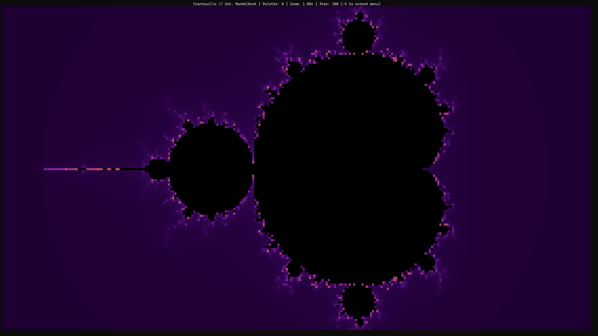
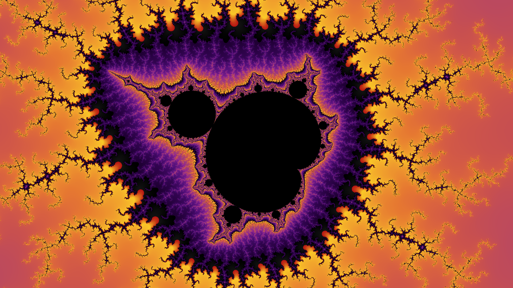
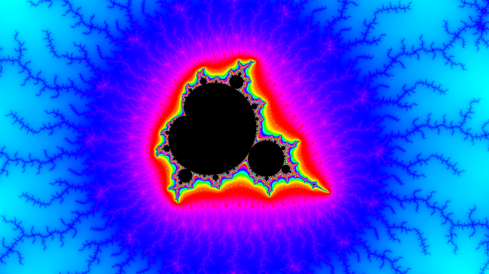

# Fractouille



A fractal exploration and rendering engine written in Rust.  
Navigate Mandelbrot, Julia, Burning Ship and Phoenix sets in real-time and export high-resolution screenshots and zoom videos.  

[](https://www.rust-lang.org/)
[](https://ratatui.rs/)
[](LICENSE)

## Getting started

```bash
git clone https://github.com/pottierloic/fractouille
cd fractouille
cargo run
```

Sixel mode for true pixel rendering in compatible terminals:

```bash
fractouille --sixel
```

`ffmpeg` is required for video recording, see [`RECORD.md`](RECORD.md) for details.

## Usage

Press `:` to enter command mode (Vim-style). Full command reference in [`COMMANDS.md`](COMMANDS.md).

| Key | Action |
|-----|--------|
| `wasd` | Move |
| `-` / `+` | Zoom |
| `r` / `f` | Adjust iterations |
| `space` | Cycle palette |
| `enter` | Switch fractal set |
| `q` | Quit |

Screenshots and records are automatically saved to your system's Pictures folder. See [`RECORD.md`](RECORD.md).

## Roadmap & Contributing

Fractouille aims to evolve into a multi-frontend fractal engine with GPU support, arbitrary precision rendering and multiple CPU render backends.  
See [`ROADMAP.md`](ROADMAP.md) for the full picture.

Contributions are welcome, there is a lot of ground to cover.

## Museum

Some really cool pictures I took can be seen in the `museum` folder.




