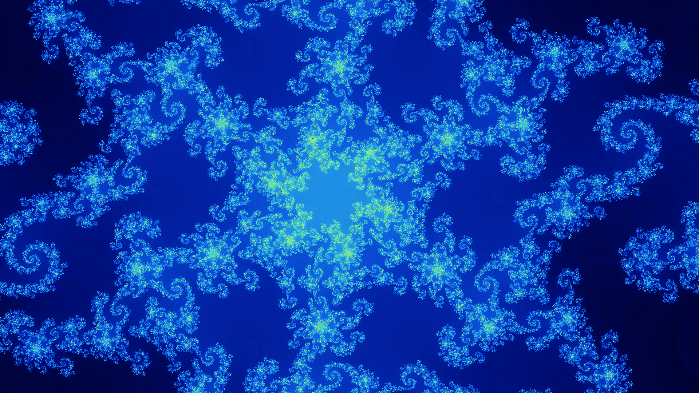

# Fractouille


Fractouille is a simple fractal explorer running in your terminal.

[](https://www.rust-lang.org/)
[](LICENSE)

## Features

- Multiple fractal sets (Mandelbrot, Julia, Burning Ship)
- High-quality screenshot capture with smooth coloring
- Interactive navigation
- Command mode for advanced usage

## Usage

```bash
# clone the repository
git clone https://github.com/pottierloic/fractouille
cd fractouille

# run directly
cargo run

# or install and run from anywhere
cargo install --path .
fractouille
```

## Keybinds

- `wasd`: Move around
- `r/f`: adjust max iterations
- `-/+`: adjust zoom level
- `space`: cycle color palette
- `enter`: switch fractal set
- `q`: quit fractouille

## Command mode

Just like in Vim, press `:` to enter command mode. 
A list of all available commands can be found by in the `COMMANDS.md` file.

# Screenshots

Screenshots are automatically saved to your system's Pictures folder inside of `fractouille_screenshots`.

Here are some screenshots:




## Roadmap

- [x] Basic fractal sets implementation
    - [x] Mandelbrot Set
    - [x] Julia Set
    - [x] Burning Ship
- [x] Screenshot functionality
    - [x] Smooth coloring
    - [x] Auto-save
- [x] Variable power parameter

- [ ] Deep zoom capability
- [ ] Customizable color palette

- [x] Phoenix Set implementation
- [ ] Newton fractals
- [ ] Lyapunov fractals
