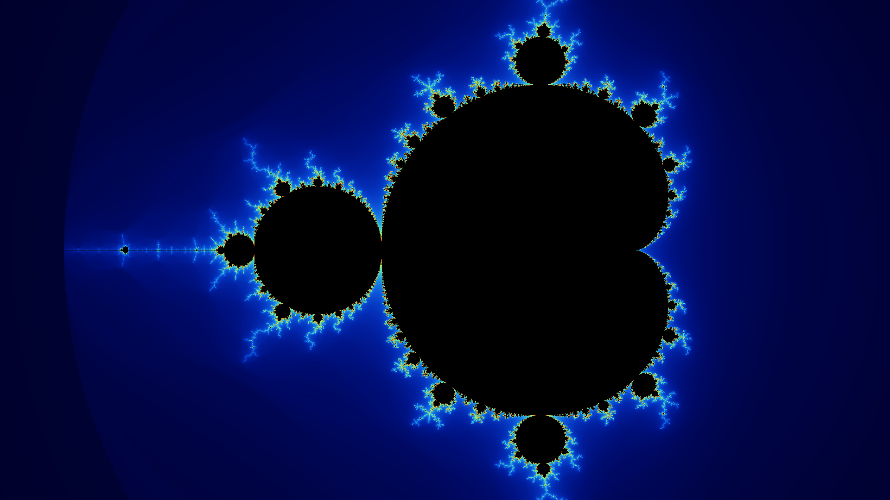
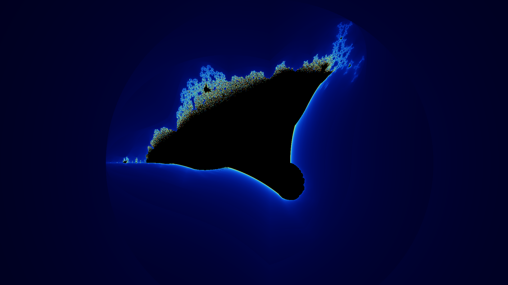
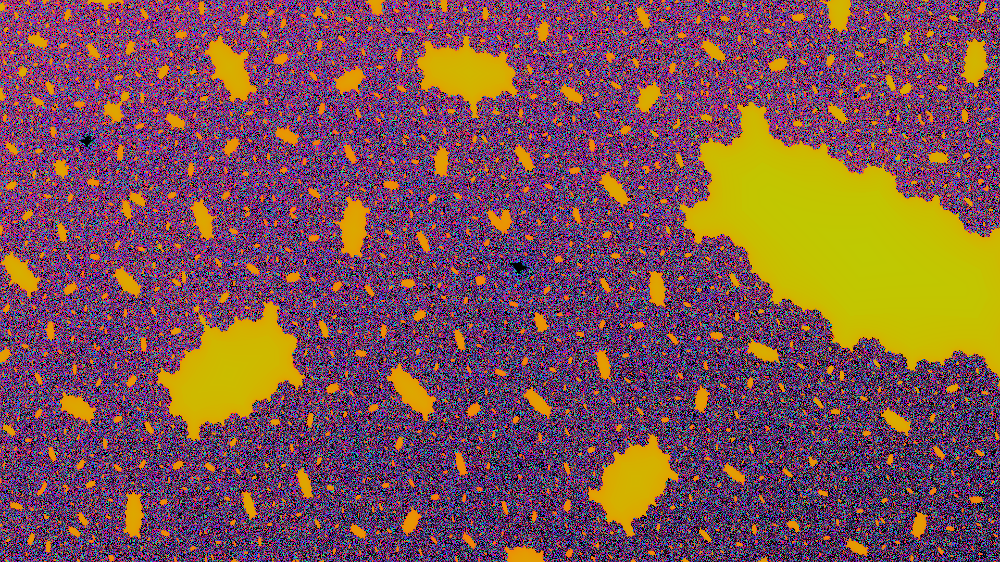

# Fractouille

Fractouille is a simple fractal explorer running in your terminal.

You can find all the keybinds in the title bar!

It is better to use cargo build --release to build it, as it is a bit slow otherwise.

TODO:
- [x] Mandelbrot
- [x] Julia
- [x] Burning Ship
- [x] Tanking screenshots
- [x] Smooth coloring on screenshots
- [ ] Have deep zoom
- [ ] Saving location
- [ ] Auto move / zoom to saved locations
- [ ] Make more and better looking color palettes
- [x] Being able to change the power, not only quadratic

Here are some screenshots:

